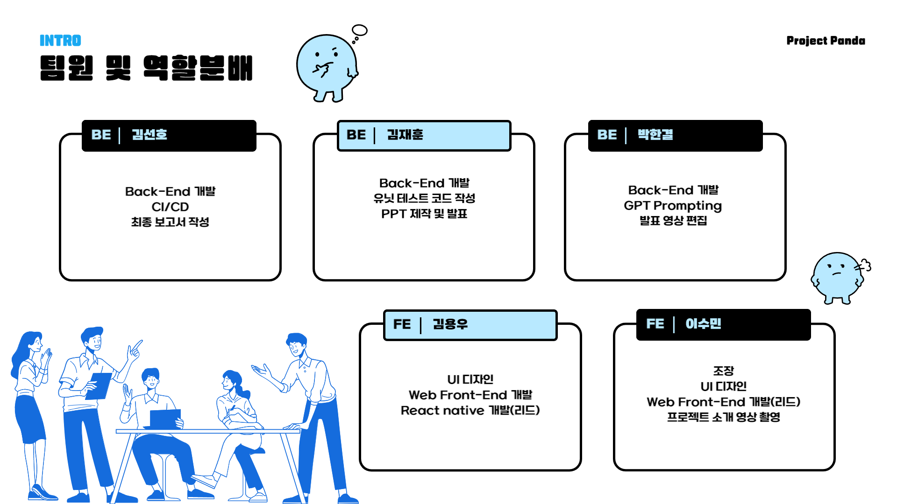
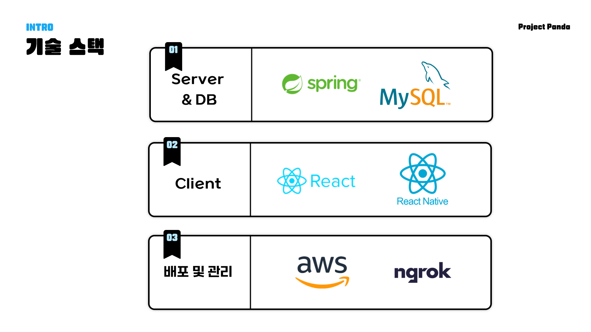

# 🐼Project Panda🐼
<br>

## 📃TABLE OF CONTENTS  
- [INTRODUCTION](#INTRO)🎉
- [DESCRIPTION OF OUR PROJECT](#DESCRIPTION)🎈
- [HOW TO INSTALL](#INSTALLATION)💻
- [EXECUTION](#EXECUTION)💫  
- [TEAM MEMBERS](#TEAM_MEMBERS)🩵
- [TECH STACK](#TECH_STACK)⚡️
- [FILE STRUCTURE](#STRUCTURE)💾
<br>

## 🎍INTRO
2024년 1학기 중앙대학교 소프트웨어 공학 코스 텀 프로젝트.🔥🔥      
이슈 관리 소프트웨어 ✨**Project Panda**✨ 입니다  
> Why is there a panda in the name?🤔 There's a sad story there...🥲  
> We couldn't get enough sleep😪 so we have dark circles as a result.👻  
> We are becoming more and more like pandas.🐼 Cheers.  
<br>

## 🎍DESCRIPTION
**프로젝트 판다** 는 소프트웨어 개발을 주 목적으로 하는 회사 등의 단체를 위한 이슈 관리 소프트웨어 입니다.  
이슈를 생성하거나 할당하는 것은 물론이고, 해당 이슈의 상태를 관리하고, 댓글 기능을 이용해 해당 이슈에 대해 조직 구성원들과 공유하는 등의 작업이 모두 가능합니다.  
이 뿐만 아니라 현재 이슈를 과거 이슈들과 비교하고, GPT API를 활용해 현재 이슈에 가장 어울리는 개발자를 추천해 주는 등 기존에 존재하는 이슈 관리 시스템과는 차별화되는 여러 기능을 통해 소프트웨어의 사용성을 높였습니다.  
**프로젝트 판다** 는 이슈 관리에 필요한 여러 기능을 API로 제공하고 있으므로, 해당 API를 활용해 여러 플랫폼에서 조직에 필요한 이슈 관리 프로그램을 개발할 수 있습니다.  
<br>  

## 🎍INSTALLATION
- **Java 17 이상 및 JDK 17 이상**
- **Node.js 14 및 npm 6 이상**
- **IntelliJ, VSCode 등 통합개발환경** (선택 사항)
<br>

- **서버 저장소 클론🔥**  
```
https://github.com/Soft-Gallery/issue-management-backEnd.git
```  

- **application.properties🔥**
```
spring.application.name=

spring.datasource.url=
spring.datasource.username=
spring.datasource.password=
spring.jpa.properties.hibernate.dialect=

#Availables: none, create, create_drop, update
spring.jpa.hibernate.ddl-auto=
spring.jpa.hibernate.naming.physical-strategy=

jwt.secret=

#Allowed Web URL
allowed.origin=

# openAI
api-key=

# Swagger Settings
# swagger-ui 접근 경로. default 값은 /swagger-ui.html이다.
springdoc.swagger-ui.path=/swagger-ui.html

# 각 API의 그룹 표시 순서. path, query, body, response 순으로 출력
springdoc.swagger-ui.groups-order=DESC

# 태그 정렬 순서. alpha: 알파벳 순 정렬, method: OpenAPI specification file에 원하는 태그 정렬 방식 직접 기재
springdoc.swagger-ui.tags-sorter=alpha

# 컨트롤러 정렬 순서. method는 delete - get - patch - post - put 순으로 정렬된다. alpha를 사용해 알파벳 순으로 정렬할 수 있다.
springdoc.swagger-ui.operations-sorter=method

# swagger-ui default url인 petstore html의 비활성화 설정
springdoc.swagger-ui.disable-swagger-default-url=true

# swagger-ui에서 try 했을 때 request duration을 알려주는 설정
springdoc.swagger-ui.display-request-duration=true

# openAPI 접근 경로. default 값은 /v3/api-docs 이다.
springdoc.api-docs.path=/api-docs

# Spring Actuator의 endpoint까지 보여줄 것인지?
springdoc.show-actuator=true

# request media type 의 기본 값
springdoc.default-consumes-media-type=application/json

# response media type 의 기본 값
springdoc.default-produces-media-type=application/json

# 해당 패턴에 매칭되는 controller만 swagger-ui에 노출한다.
springdoc.paths-to-match=/**
```

- **프론트엔드 저장소 클론🔥**
```
https://github.com/Soft-Gallery/issue-management-frontEnd.git
```
- **모바일 앱 저장소 클론🔥**
```
https://github.com/Soft-Gallery/issue-management-app.git
```
<br>

## 🎍EXECUTION

**웹 링크** : http://54.166.71.13  
실행 이미지...넣어야 함  
<br>

## 🎍TEAM_MEMBERS
저희 팀을 소개합니다🤗

- **김선호**: **Back-End Dev**/중앙대학교 소프트웨어학부 20
- **김용우**: **Lead Mobile-App Dev**/중앙대학교 소프트웨어학부 20
- **김재훈**: **Back-End Dev**/중앙대학교 소프트웨어학부 20
- **박한결**: **Back-End Dev**/중앙대학교 소프트웨어학부 20
- **이수민**: **Lead Front-End Dev**/중앙대학교 소프트웨어학부 20  


<br>

## 🎍KEY_FEATURE

- **Role Management**  
`ADMIN`, `DEVELOPER`, `TESTER`, `PL` 네가지 `ROLE`이 존재하고, 해당 `ROLE`이 접근할 수 있는 엔드 포인트를 제한하고 있습니다.  
추가적인 롤이 필요하면 명세에 새로운 `ROLE`의 타입을 기입하고, `USER` 클래스를 상속받아 기능을 구현하여 사용할 수 있습니다.  
<br>

- **Issue Management**  
이슈의 `할당`, `상태 변경`, `해결` 등의 기능을 제공합니다.
이슈를 보고하는 `reporter`, 이슈를 할당받는 `assignee`, 이슈를 해결하는 `fixer` 등을 두어 이슈를 해당하는 주체를 정할 수 있습니다.   
또한 각 `ROLE`에 해당하는 유저들이 상호작용을 통해 해당 이슈의 상태를 `NEW`, `ASSIGNED`, `FIXED`, `RESOLVED`, `CLOSED`, `REOPENED` 등으로 바꾸며 상태 관리를 할 수 있습니다.  
<br>

- **Recommend Assignee**  
  `GPT API` 서비스를 이용해 현재 이슈에 가장 어울리는 `Assignee` 추천해 이슈에 개발자를 담당시킬 때 도움을 받을 수 있습니다.  
  현재 이슈를 해결할 수 있는 이슈가 발생한 프로젝트에 속해 있는 개발자들의 과거 이슈 해결 내역 및 해당 이슈의 중요도 등의 정보와 더불어
  각 개발자들이 현재 수행중인 이슈들의 개수와 중요도 등을 다방면에서 평가하여 현재 이슈를 담당할 개발자를 추천합니다.  
  <br>  
  
- **Project Management**  
프로젝트의 `생성`, `업데이트`, `삭제` 및 `상태 변경` 기능을 제공합니다.  
특정한 ROLE(ADMIN 등)에 해당하는 유저는 특정한 API 엔드포인트를 통해 프로젝트에 참가할 유저들을 `추가` 할 수 있습니다.    
<br>

- **Comment**  
이슈에 달리는 `Comment`를 관리하는 기능을 제공합니다.  
이슈의 상태가 변하는 상황을 포함해 필요한 여러 상황에 협업을 위한 `Comment`를 추가 할 수 있습니다.    
<br>

- **Statistics**  
프로젝트의 `이슈 통계` `수집` 및 `관리` 기능을 제공합니다.  
프로젝트 내부와 외부에서 이슈들의 정보를 수집해 `수치화 된 데이터`를 제공합니다.  
클라이언트에서 이 정보들을 활용해 시각적인 통계 기능을 구현할 수 있습니다.  
<br>

- **Security**  
`JWT 토큰`을 이용한 로그인을 구현했습니다.  
`JWT 토큰` `생성`, `유효성 검사` 및 `파싱` 등의 기능을 포함하고 있습니다.  
또한 사용자의 예민한 정보(비밀번호) 등은 `암호화`하여 디비에 저장하고 있습니다     
<br>  

## 🎍TECH_STACK
           

  
<br>

## 🎍STRUCTURE
- 2024.06.02 ver
```
src
├── main
│   ├── java
│   │   └── com
│   │       └── softgallery
│   │           └── issuemanagementbackEnd
│   │               ├── IssueManagementBackEndApplication.java
│   │               ├── authentication
│   │               │   ├── CustomUserDetails.java
│   │               │   ├── CustomUserDetailsService.java
│   │               │   ├── JWTFilter.java
│   │               │   ├── JWTUtil.java
│   │               │   └── LoginFilter.java
│   │               ├── config
│   │               │   ├── CORsMVCConfig.java
│   │               │   ├── ChatGptConfig.java
│   │               │   ├── CorsConfig.java
│   │               │   ├── SecurityConfig.java
│   │               │   └── SwaggerConfig.java
│   │               ├── controller
│   │               │   ├── Home.java
│   │               │   ├── chat_gpt
│   │               │   │   └── ChatGptController.java
│   │               │   ├── comment
│   │               │   │   └── CommentController.java
│   │               │   ├── issue
│   │               │   │   └── IssueController.java
│   │               │   ├── project
│   │               │   │   └── ProjectController.java
│   │               │   ├── project_member
│   │               │   │   └── ProjectMemberController.java
│   │               │   ├── statistics
│   │               │   │   └── StatisticsController.java
│   │               │   └── user
│   │               │       └── UserController.java
│   │               ├── dto
│   │               │   ├── chat_gpt
│   │               │   │   ├── ChatGptRequestDTO.java
│   │               │   │   ├── ChatGptResponseDTO.java
│   │               │   │   ├── Choice.java
│   │               │   │   ├── Message.java
│   │               │   │   └── QuestionRequestDTO.java
│   │               │   ├── comment
│   │               │   │   └── CommentDTO.java
│   │               │   ├── issue
│   │               │   │   ├── IssueCreationRequestDTO.java
│   │               │   │   └── IssueDTO.java
│   │               │   ├── project
│   │               │   │   └── ProjectDTO.java
│   │               │   ├── project_member
│   │               │   │   └── ProjectMemberDTO.java
│   │               │   ├── statistics
│   │               │   │   └── StatisticsDTO.java
│   │               │   └── user
│   │               │       └── UserDTO.java
│   │               ├── entity
│   │               │   ├── comment
│   │               │   │   └── CommentEntity.java
│   │               │   ├── issue
│   │               │   │   └── IssueEntity.java
│   │               │   ├── project
│   │               │   │   └── ProjectEntity.java
│   │               │   ├── project_member
│   │               │   │   └── ProjectMemberEntity.java
│   │               │   ├── statistics
│   │               │   │   └── StatisticsEntity.java
│   │               │   └── user
│   │               │       ├── AdminEntity.java
│   │               │       ├── DeveloperEntity.java
│   │               │       ├── PLEntity.java
│   │               │       ├── TesterEntity.java
│   │               │       └── UserEntity.java
│   │               ├── exception
│   │               │   ├── ObjectNotFoundException.java
│   │               │   └── ProjectMemberNotFoundException.java
│   │               ├── repository
│   │               │   ├── comment
│   │               │   │   └── CommentRepository.java
│   │               │   ├── issue
│   │               │   │   └── IssueRepository.java
│   │               │   ├── project
│   │               │   │   └── ProjectRepository.java
│   │               │   ├── project_member
│   │               │   │   └── ProjectMemberRepository.java
│   │               │   ├── statistics
│   │               │   │   └── StatisticsRepository.java
│   │               │   └── user
│   │               │       └── UserRepository.java
│   │               └── service
│   │                   ├── chatGpt
│   │                   │   ├── ChatGptService.java
│   │                   │   ├── ChatGptServiceIF.java
│   │                   │   └── GptPrompt.java
│   │                   ├── comment
│   │                   │   ├── CommentService.java
│   │                   │   └── CommentServiceIF.java
│   │                   ├── custom_annotation
│   │                   │   ├── IDRule.java
│   │                   │   └── PasswordRule.java
│   │                   ├── issue
│   │                   │   ├── IssueService.java
│   │                   │   ├── IssueServiceIF.java
│   │                   │   ├── MainCause.java
│   │                   │   ├── Priority.java
│   │                   │   └── State.java
│   │                   ├── project
│   │                   │   ├── ProjectService.java
│   │                   │   ├── ProjectServiceIF.java
│   │                   │   └── ProjectState.java
│   │                   ├── projectMember
│   │                   │   ├── ProjectMemberService.java
│   │                   │   └── ProjectMemberServiceIF.java
│   │                   ├── statistics
│   │                   │   ├── StatisticsService.java
│   │                   │   └── StatisticsServiceIF.java
│   │                   └── user
│   │                       ├── Role.java
│   │                       ├── UserEntityFactory.java
│   │                       ├── UserService.java
│   │                       └── UserServiceIF.java
│   └── resources
│       └── application.properties
└── test
    └── java
        └── com
            └── softgallery
                └── issuemanagementbackEnd
                    ├── IssueManagementBackEndApplicationTests.java
                    └── service
                        ├── chatGpt
                        │   └── ChatGptServiceTest.java
                        ├── comment
                        │   └── CommentServiceTest.java
                        ├── custom_annotation
                        │   └── IDRuleTest.java
                        ├── issue
                        │   └── IssueServiceTest.java
                        ├── project
                        │   └── ProjectServiceTest.java
                        ├── projectMember
                        │   └── ProjectMemberServiceTest.java
                        ├── statistics
                        │   └── StatisticsServiceTest.java
                        └── user
                            └── UserServiceTest.java


```

